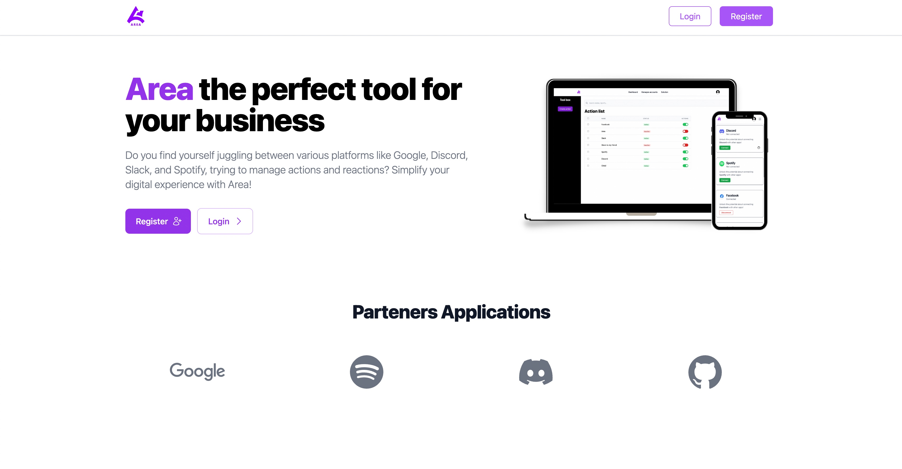
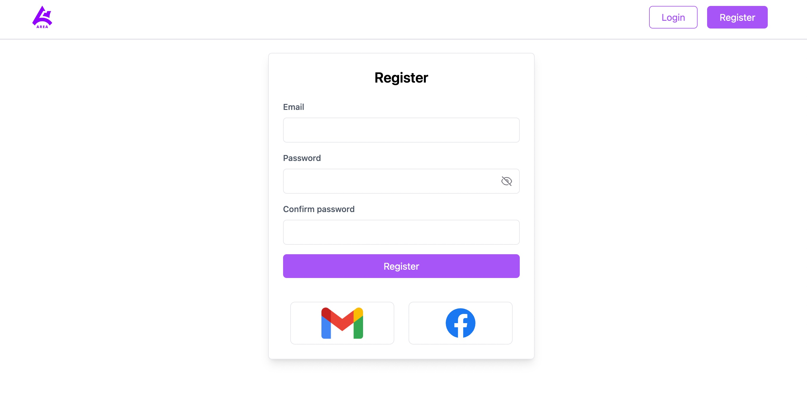
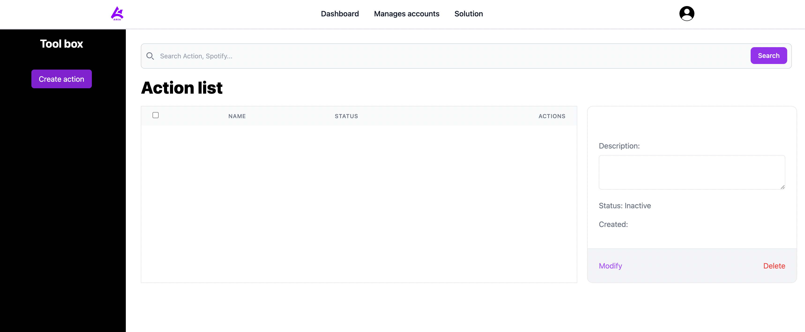
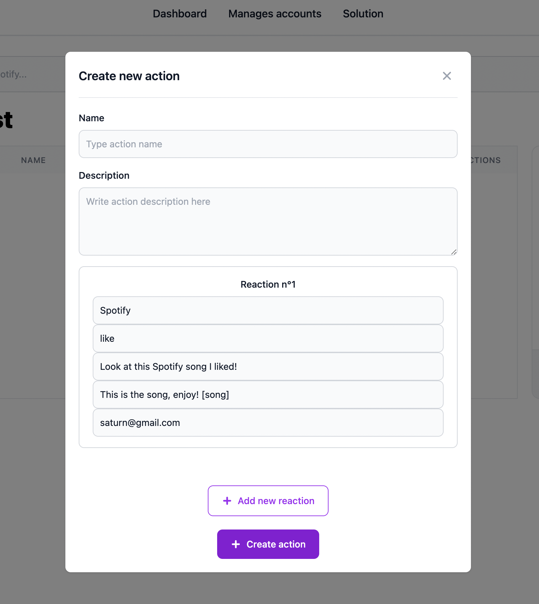
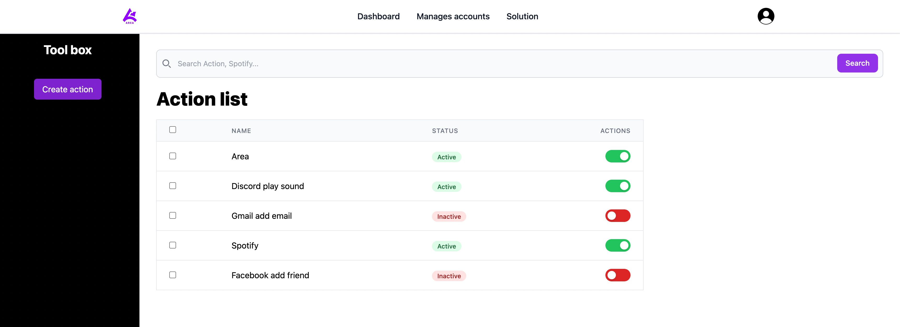
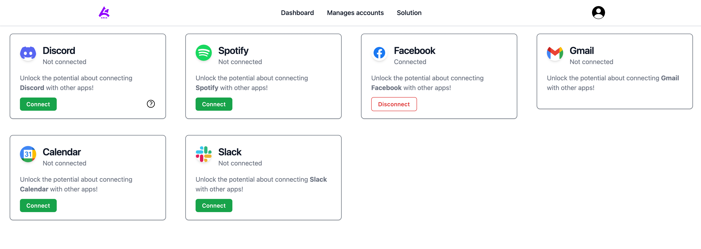

# Area User Guide

## Getting Started

You will arrive on this page:

### Register

Register a account. You can use your email adress, Facebook or Gmail:

### Dashboard

The dashboard is presented as follows:

You can create a action in button "Create action"

In this section:

- Name: how you name your action.

- Description: a brief description on your action.

- Reaction: you can add as many reactions as you want. Just press the 'Add new reaction' button.

You can add as many Actions / Reactions as you want, and you can activate or not this actions:

Customize it as you wish.

NOTE: you MUST be connected to the various services to perform actions/reactions. See Manages accounts page.

### Manages accounts

This page allows you to connect to the various services offered by Area. It is presented as follows:

Click on "Connect" for uses services.

