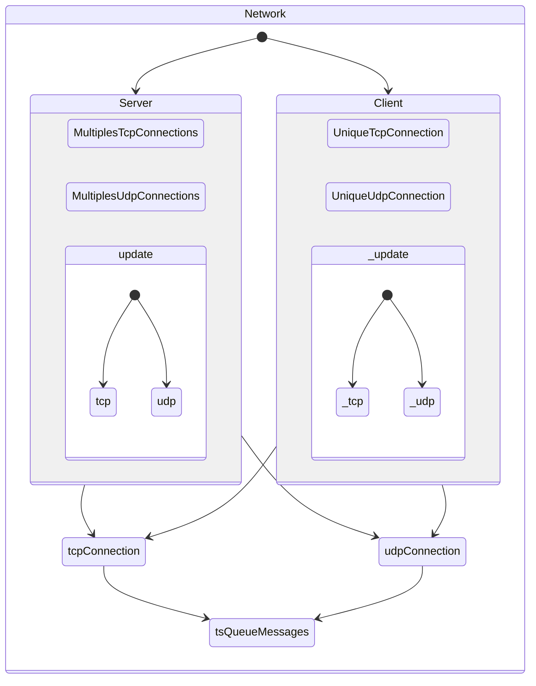

# Networking Library

## Introduction

The networking is a really important part of the project.
It is used to communicate between the server and the client.


## Objectif

The stake of this part is to be able to send and receive any kind of data.
It has to be fast and reliable.


## Architectural View


## Main systems

The main system of the FLib is the Tcp protocol.
The lib is encapsulated by the GameEngine.
However, the lib is provided with a custom utilisation wich uses tcp protocol to connect to clients and to validate them.
For the lobby handler, it uses a tcp protocol to sync the clients.
Then when the game starts, it uses an udp custom protocol that sends and receive datas faster.
Those two protocol works together, each one has his own strenght, and his weaknesses.
Use the tcp to send important informations because the udp is less reliable and could lose the packet.
However, we implemented a checksum to make sure that the packet is not corrupted.
if the checksum is corrupted, the packet is discarded.

## Usage

the network interface is based on the [asio](https://think-async.com/Asio/) library.
it is working on all platforms and is fully customisable.
To use the FLib, you have to create custom DataTypes.
Those DataTypes will be used to identify the type of data that you want to send.

You can add or modify those DataTypes in the file `protocol.hpp` wich is located in ``GameEngine/inc/Network/``.

Here is an example:

```cpp
    enum class CustomMsgTypes : uint32_t
    {
        PlayerData,
        FireBullet,
        MovePlayer,
        PlayerHealth
    };
```
This is basicly an enum that you can use to implement different behaviors.
Those DataTypes will be used in the Networking implementation. Go to Data Transfer for more details.
Now all you have to do is to create a client and a server.
Send datas using the `message` class and upon receive use the message class to extract the datas.
Now all you have to do is get the incomingTcp and incomingUdp functions to get the incoming messages.

```cpp
    net::Queue<net::OwnedMessageUdp<udpProtocol>>& netIncomingUdp();

    net::Queue<net::OwnedMessage<tcpProtocol>>& netIncomingTcp();
```

Those functions will return a queue of messages.
You can use the `pop` method to get the first message of the queue.
those queues are thread safe, so you can use them in different threads.

## Here is a simple example of how to use the network library.

### message Class

```cpp
template <typename T>
    struct MessageHeader
    {
        T id{}; // {} = default value / constructor for class
        size_t size = 0;
    };

template <typename T>
    struct message
    {
        MessageHeader<T> header;
        std::vector<uint8_t> body;
    };
```
This is the basic structure of a message.
The `MessageHeader` contains the custom data type that we created earlier.
Thanks to the `id{}` syntaxe, it can be any type of data, even struct or class (in those cases the constructor will be called by default).

### Create a TCP message

```cpp
    net::message<CustomMsgTypes> msg;
    msg.header.id = CustomMsgTypes::PlayerData;
```
### Fill a TCP message

```cpp
    int a = 5;
    float b = 3.14f;
    struct
    {
        int a;
        int b;
    } data[5];

    msg << a << b << data;
```

### Extract data from a TCP message

```cpp
    int a;
    float b;
    struct
    {
        int a;
        int b;
        float c;
    } data[5];

    msg >> data >> b >> a;
```
As you can see we `filled` the message in the order **[a -> b -> data]**

And then we `extracted` the data in the order **[data -> b -> a]**

This is because the message structure works like a pile. So the last item we put in the message will be the first one we extract.

## Client

```cpp
    Client::Client();
```
This method will `create` a client

### Client::connect()

```cpp
bool connect(const std::string& host, const size_t port)
```

This method will `connect` the client to the given host and port\
Returns true if the connection is successful, false otherwise


## Server

```cpp
Server::Server(uint16_t port);
```
this method will `create` a server on the given port

### Server::start()

```cpp
bool Server::start();
```
this method will `start` the server

if an error occurs it will throw an exception and print the error message on the error output

then it will return false

otherwise it will return true and the server will be running


### Server::stop()

```cpp
void Server::stop();
```
this method will `stop` the server

### Server::messageClient()

```cpp
void messageClient(std::shared_ptr<connection<T>> client,
                   const Message<T>& msg)
```

This method will `sends a message` to a connected client.
If the client has disconnected, it removes the client from the list of connections.

### Server::messageAllClients()

```cpp
void messageAll(const Message<T>& msg)
```

This method will `sends a message` to all connected clients.

### Server::update()

```cpp
void update(size_t maxMessages = -1)
```

This method will `update` the server by processing incoming messages
It take one argument maxMessages.
Default value is -1, which means all available messages will be processed.

### Server::onMessage()

```cpp
virtual void onMessage(std::shared_ptr<connection<T>>& client, Message<T>& msg)
```

This method is called when a `message is received`.\
It is a virtual method, so you can override it to implement your own behavior.

### Udp Server

```cpp
class customServer : public net::server<tcpProtocol>
```

Custom server class that inherits from the server class and uses the UDP protocol.\
You can find the same methods as the server class.\
The only difference is that the custom server class uses the `UDP` protocol.

### customServer::startLobby

```cpp
void startLobby();
```

This method will `start` the lobby.
It will create a udp socket and send it to clients so they can start to communicate on it.
Then, the server will add the Clients to his list upon reception of the first message


## Contributing

If you want to contribute to this part of the project, you can do several things:
    - Add new DataTypes
    - Implement differents custom clients and servers
    - Add new protocols
    - Add new features

Then you can make a pull request and we will review it.

Keep in mind the code style and the naming convention.
Here is a little reminder:
    - The variables and methods names are in camelBack
    - The classes names are in CamelCase
    - The macros names are in CAPITAL_LETTERS
    - The namespaces names are in snake_case
    - The brackets have to be on the same line for statements and on the next line for functions
    - The indentation is 4 spaces


## Protocol documentation

{{RFC|1234|auteur=Théo Liennard|titre=A simple custom protocol for the FLib|date=2023-10-23|}}

Here, we will be talking about the protocol used in the custom client and server.
The protocol is based on the TCP and UDP protocol.

### TCP Protocol

The TCP protocol is used to connect the client to the server and to validate the client.
It is also used to send important informations because it is more reliable than the UDP protocol.

```cpp
enum class tcpProtocol : uint8_t
{
    Udp,
    StartRoom
};
```
As you can see, the tcp protocol is really simple.
It only contains two commands:
    - Udp: this command is used to tell the client that the server is starting a udp protocol and that the client has to connect to the udp socket.
        The port and the ip of the udp socket are sent in the message.
    - StartRoom: this command is used to tell the server that the client want to start a server, this can be used to let clients create their own room.

#### Packages

```cpp
    struct Message {
        MessageHeader<T> header;
        std::vector<uint8_t> body;
    }
```
The header of the message contains the type of the message and the size of the body.
The body contains the data that we want to send.
It is sent using a vector of uint8_t.

### UDP Protocol

So, now that game is started and the client is connected to the udp socket,
we can use the udp protocol to send and receive datas faster than with the tcp protocol.

```cpp
enum class udpProtocol : uint8_t
{
    ConnectedPlayer,
    CreatePlayer,
    CreateEnnemy,
    CreateBullet,
    Destroy,
    PlayerMove,
    Resync,
};
```
As you can see, the udp protocol is more complex than the tcp protocol.
This is because we need to send more informations.

In this example, the server owns every game objects.
So the client has to ask the server to create a game object.
And the server has to send the informations of the game objects to the client.
It is also necessary to send the informations of the players to the other players.

By using this server side architecture, we can avoid cheating.
And we can also avoid the problem of synchronisation between the clients.
The server has the official version of the game, and the clients are just displaying it.

So now that we know why we need to send all those informations, let's see how we do it.

Let's take the example of the player.
At the beginning of the game, the server send to each player, a `CreatePlayer` message.
This message contains the informations of the player.
Then, each time the player moves, the client send a `PlayerMove` message to the server.
The server will then send a `PlayerMove` message to all the other players.

And so on for the other game objects.

The resync command is used to resync the client with the server.
It is used x times per second to make sure that the client is up to date.

#### Packages

```cpp
    #define MSG_SIZE 1024

    struct MessageUdp {
        MessageHeaderUdp<T> header;
        std::array<uint8_t, MSG_SIZE - sizeof(header)> body = {};
    }
```

The header of the message contains the type of the message.
The body contains the data that we want to send.
Here we use an array of uint8_t because the size of the body is fixed.
Each package has a size of 1024 bytes.
It is necessary to use a fixed size because the udp protocol does not guarantee the order of the packages.

## Authors/Contacts

Principals contributors:
    - [TotoFunki] : https://github.com/TotoFunki
    - [ClementMNT] : https://github.com/ClementMNT

## Useful Links

Asio documentation: https://think-async.com/Asio/.

## Conclusion


Résumez les points clés de la documentation de cet aspect et réitérez son importance dans le cadre du projet. Mentionnez d'éventuels développements ou améliorations futurs.

Hésitez pas à regarder comment faire dans les fichiers markdown si vous voulait faire des truc un peux sytlé pour savoir les package qu'on a il sont:
    - [pymdownx](https://facelessuser.github.io/pymdown-extensions/)
    - [material-mkdocs](https://squidfunk.github.io/mkdocs-material/reference/admonitions/#admonition-icons-octicons)