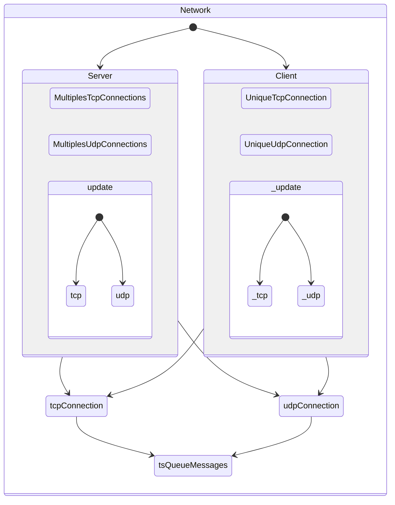

# Networking Library

## Introduction

The networking is a really important part of the project.
It is used to communicate between the server and the client.


## Objectif

The stake of this part is to be able to send and receive any kind of data.
It has to be fast and reliable.


## Architectural View


## Main systems

The main system of the FLib is the Tcp protocol.
The lib is encapsulated by the GameEngine.
However, the lib is provided with a custom utilisation wich uses tcp protocol to connect to clients and to validate them.
For the lobby handler, it uses a tcp protocol to sync the clients.
Then when the game starts, it uses an udp custom protocol that sends and receive datas faster.
Those two protocol works together, each one has his own strenght, and his weaknesses.
Use the tcp to send important informations because the udp is less reliable and could lose the packet.
However, we implemented a checksum to make sure that the packet is not corrupted.
if the checksum is corrupted, the packet is discarded.

## Usage

the network interface is based on the [asio](https://think-async.com/Asio/) library.
it is working on all platforms and is fully customisable.
To use the FLib, you have to create custom DataTypes.
Those DataTypes will be used to identify the type of data that you want to send.

You can add or modify those DataTypes in the file `protocol.hpp` wich is located in ``GameEngine/inc/Network/``.

Here is an example:

```cpp
    enum class CustomMsgTypes : uint32_t
    {
        PlayerData,
        FireBullet,
        MovePlayer,
        PlayerHealth
    };
```
This is basicly an enum that you can use to implement different behaviors.
Those DataTypes will be used in the Networking implementation. Go to Data Transfer for more details.
Now all you have to do is to create a client and a server.
Send datas using the `message` class and upon receive use the message class to extract the datas.
Now all you have to do is get the incomingTcp and incomingUdp functions to get the incoming messages.

```cpp
    net::Queue<net::OwnedMessageUdp<udpProtocol>>& netIncomingUdp();

    net::Queue<net::OwnedMessage<tcpProtocol>>& netIncomingTcp();
```

Those functions will return a queue of messages.
You can use the `pop` method to get the first message of the queue.
those queues are thread safe, so you can use them in different threads.

## Here is a simple example of how to use the network library.

### message Class

```cpp
template <typename T>
    struct MessageHeader
    {
        T id{}; // {} = default value / constructor for class
        size_t size = 0;
    };

template <typename T>
    struct message
    {
        MessageHeader<T> header;
        std::vector<uint8_t> body;
    };
```
This is the basic structure of a message.
The `MessageHeader` contains the custom data type that we created earlier.
Thanks to the `id{}` syntaxe, it can be any type of data, even struct or class (in those cases the constructor will be called by default).

### Create a TCP message

```cpp
    net::message<CustomMsgTypes> msg;
    msg.header.id = CustomMsgTypes::PlayerData;
```
### Fill a TCP message

```cpp
    int a = 5;
    float b = 3.14f;
    struct
    {
        int a;
        int b;
    } data[5];

    msg << a << b << data;
```

### Extract data from a TCP message

```cpp
    int a;
    float b;
    struct
    {
        int a;
        int b;
        float c;
    } data[5];

    msg >> data >> b >> a;
```
As you can see we `filled` the message in the order **[a -> b -> data]**

And then we `extracted` the data in the order **[data -> b -> a]**

This is because the message structure works like a pile. So the last item we put in the message will be the first one we extract.

## Network Class, A client and a server in one class

The network class is a class that contains fonctions to create a client or a server.
However, it can't be both at the same time.

### Server Creation

```cpp
    void netCreateServer(uint16_t port, std::string ipAdress);
```
This method will `create` a server on the given port and ipAdress
Upon creation, it will be impossible to call client related methods

### Client Creation and connection

```cpp
    bool netConnectToServer(const std::string& host, const size_t port);
```
This method will `connect` the client to the given host and port\
Returns true if the connection is successful, false otherwise
Upon connection, it will be impossible to call server related methods

### Server start

```cpp
    bool netStartServer();
```
this method will `start` the server

if an error occurs it will throw an exception and print the error message on the error output

then it will return false

otherwise it will return true and the server will be running


### Server stop

```cpp
    void netStopServer();
```
this method will `stop` the server


## Messaging Methods (Client and Server)

```cpp
    void netSendTcpMessage(std::shared_ptr<Connection<tcpProtocol>> peer, const Message<tcpProtocol>& msg);
```

This method will `sends a message` to a connected peer.
If the client has disconnected, it removes the peer from the list of connections.

### Messaging all peers

```cpp
    void netSendTcpMessageToAll(const Message<tcpProtocol>& msg);
```

This method will `sends a message` to all connected peers.
if a client run this method, it will send the message to the server since it is the only peer connected to the client.


### Udp Part in Network Class (Client and Server)

The network class is also able to send and receive udp messages.
It provides a fast but less reliable way to send datas.
However, the datas are checked with a checksum to make sure that the packet is not corrupted.

### Network::createDataChannel

```cpp
    void netCreateDataChannel(std::string ipAdress, uint16_t port);
```

This method will `create` a udp socket and bind it to the given port and ipAdress.
It will also create a thread that will listen to incoming messages.


### Sending Udp Messages

Like the tcp messages, the udp messages are sent using a `udpMessage` class.

```cpp
    void netUdpSend(net::MessageUdp<udpProtocol>& msg, asio::ip::udp::endpoint peer);
```

This method will `send` a udp message to the given peer.

```cpp
    void netUdpSendAll(net::MessageUdp<udpProtocol>& msg);
```

This method will `send` a udp message to all peers.

### udpMessages

The udp messages are a little bit different from the tcp messages.

```cpp
    template <typename T>
    struct MessageHeaderUdp {
        T id{};
        size_t size = 0;
        uint32_t checksum = 0;
    };

    template <typename T>
    struct MessageUdp {
        MessageHeaderUdp<T> header;
        std::array<uint8_t, MSG_SIZE - sizeof(header)> body = {};
    };
    ...
```

So we have the checksum that we talked about earlier.
THe other difference that we can see is that the packet size is fixed.
Currently, the size is 1024 bytes. But it can be changed in the MSG_SIZE macro in the udp_msg file.
It is because the udp protocol sends a lots of messages per second and we don't want to get fused packets.

### Network::startLobby

```cpp
void startLobby();
```

This method will `start` the lobby.
It will create a udp socket and send it to clients so they can start to communicate on it.
Then, the server will add the Clients to his list upon reception of the first message.
This method is called by the server only.
Then the server will send a message to all clients to tell them to start the lobby.


## Contributing

If you want to contribute to this part of the project, you can do several things:
    - Add new DataTypes
    - Implement differents custom clients and servers
    - Add new protocols
    - Add new features

Then you can make a pull request and we will review it.

Keep in mind the code style and the naming convention.
Here is a little reminder:
    - The variables and methods names are in camelBack
    - The classes names are in CamelCase
    - The macros names are in CAPITAL_LETTERS
    - The namespaces names are in snake_case
    - The brackets have to be on the same line for statements and on the next line for functions
    - The indentation is 4 spaces


## Authors/Contacts

Principals contributors:
    - [TotoFunki] : https://github.com/TotoFunki
    - [ClementMNT] : https://github.com/ClementMNT

## Useful Links

Asio documentation: https://think-async.com/Asio/.

## Conclusion

So as you have seen, the networking is a really important part of the project.
it is the part that provide the game to the client and make it playable.
It is also the part that makes the game multiplayer.
It was a really interesting part to work on.
We learned a lot of things about networking and we hope that you will enjoy it too.
