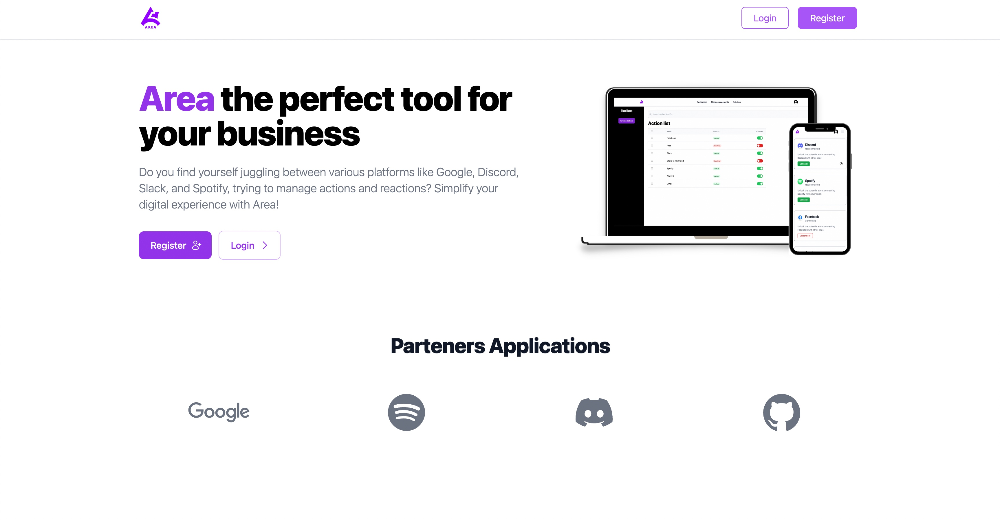
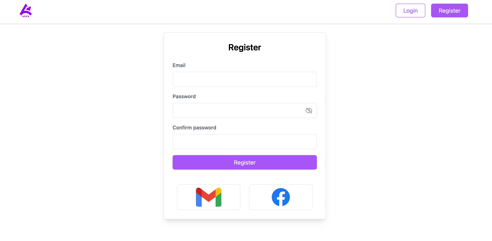
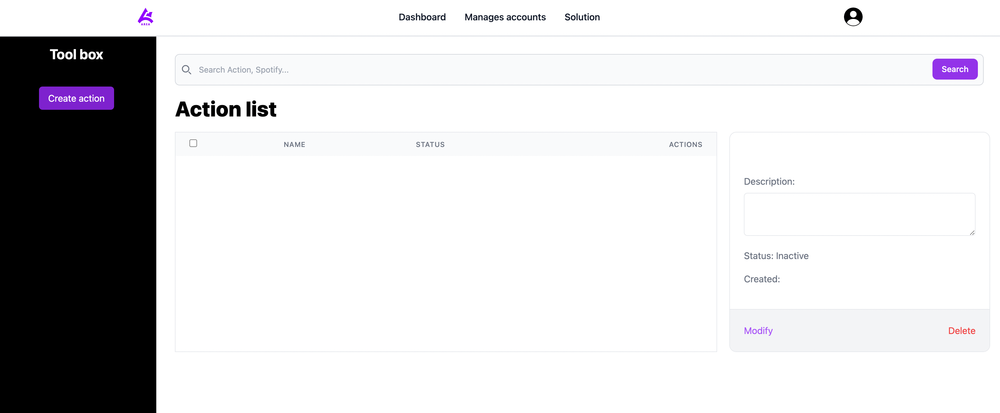
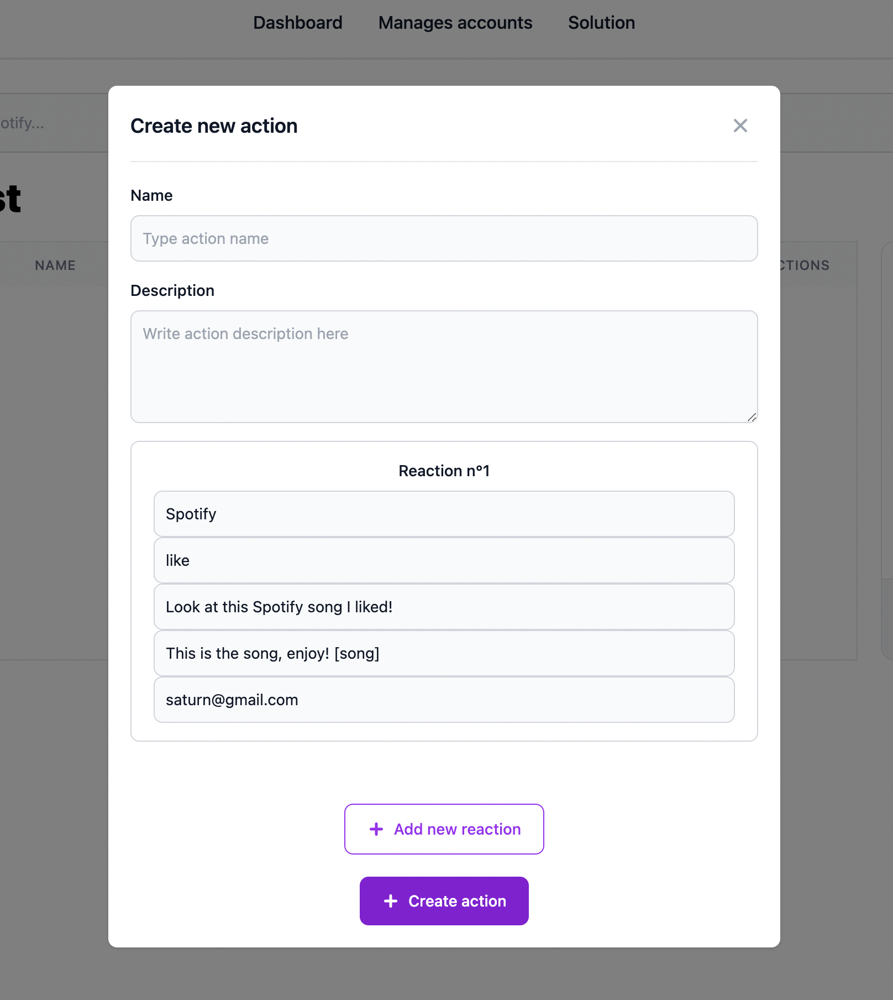
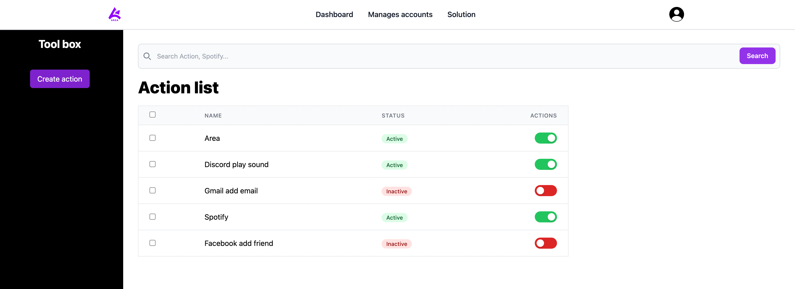
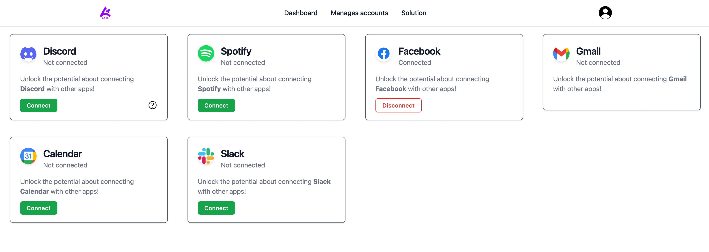

# AREA User Guide

## Introduction

Welcome to Area! This comprehensive user guide is designed to help you make the most out of our application. Whether you're a new user or seeking to explore advanced features, this guide will provide step-by-step instructions, tips, and insights to enhance your experience.

## About Area

The goal of this project is to discover, as a whole, the software platform that you have chosen through the
creation of a business application.

To do this, you must implement a software suite that functions similar to that of IFTTT and/or Zapier.
This software suite will be broken into three parts :

• An application server to implement all the features listed below (see Features)

• A web client to use the application from your browser by querying the application server

• A mobile client to use the application from your phone by querying the application server

## How to Use This Guide

This user guide is organized into sections, each focusing on a specific aspect of Area. Use the following table of contents to navigate to the topics that interest you the most:

- **[Section 1: Prerequisites](#prerequisites)**

    Learn how to install dependencies and prerequisites for launch Area web site.

- **[Section 2: Installation](#installation)**

    Install all dependencies for server and web.

- **[Section 3: Getting Started](#getting-started)**

    Dive into the key features of Area, with step-by-step instructions on how to use them effectively.
    This section guides you step by step on how to use Area.

    - [Register](#register)
    - [Dashboard](#dashboard)
    - [Manages accounts](#manages-accounts)


## Prerequisites

Before you begin, make sure you have the following installed:

- [Node.js](https://nodejs.org/)
- [Yarn](https://yarnpkg.com/)

For MacOS use Hombrew:

```bash
/bin/bash -c "$(curl -fsSL https://raw.githubusercontent.com/Homebrew/install/HEAD/install.sh)"

brew install node

brew install yarn
```

## Installation

1. **Clone the repository:**
```bash
git clone git@github.com:EpitechPromo2026/B-DEV-500-MAR-5-2-area-thibault.avon.git
cd B-DEV-500-MAR-5-2-area-thibault.avon
```

2. **Install dependencies for API:**
```bash
cd AREA-API
yarn
```

3. **Install dependencies for Web:**

    Open another terminal and past:
```bash
cd AREA-WEB
yarn
```

4. **Running server:**

    On AREA-API, run:
```bash
yarn dev
```

5. **Running Web page:**

    On AREA-WEB, run:
```bash
yarn start
```

## Getting Started

You will arrive on this page:



### Register

Register a account. You can use your email adress, Facebook or Gmail:



### Dashboard

The dashboard is presented as follows:



You can create a action in button "Create action"



In this section:

- Name: how you name your action.

- Description: a brief description on your action.

- Reaction: you can add as many reactions as you want. Just press the 'Add new reaction' button.

You can add as many Actions / Reactions as you want, and you can activate or not this actions:



Customize it as you wish.

NOTE: you MUST be connected to the various services to perform actions/reactions. See Manages accounts page.

### Manages accounts

This page allows you to connect to the various services offered by Area. It is presented as follows:



Click on "Connect" for uses services.
